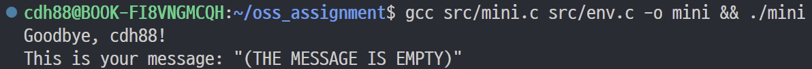
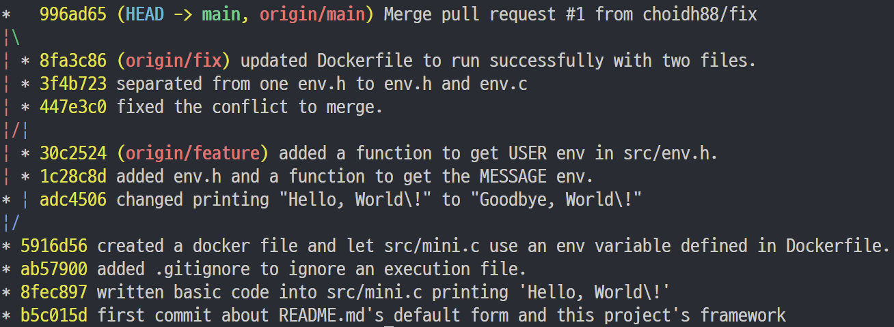

# mini-cli

&nbsp;이 리포지토리는 '오픈소스소프트웨어 이해와 실습'의 과제에 사용된 과제물입니다.

---

# 🛠️ Mini CLI Tool Project

&nbsp;해당 CLI 프로그램은 `Dockerfile` 내 `ENV`로 설정된 환경변수 `MESSAGE`를 가져와 출력하여 인사하는 프로그램입니다. 환경변수 `USER`가 존재하는 경우 이 또한 출력합니다.<br>
&nbsp;로컬 환경에서는 WSL을 이용했습니다. Visual Studio Code를 이용했으며 Linux 환경에서 gcc, Docker 등을 통해 개발했습니다. gcc로 컴파일하고 Docker를 통해 이미지를 생성하고 실행 가능하도록 했습니다.<br>
&nbsp;또한 git과 Github를 이용하고 버전 관리함으로써 관련 실습을 진행했습니다. git의 `commit`, `branch`, `push` 등의 기능을 실습하는 등, '오픈소스소프트웨어 이해와 실습' 전공 과목에서 배운 바를 활용했습니다.

---

## 📁 프로젝트 구조

```
mini-cli/
├── Dockerfile
├── LICENSE
├── README.md
├── docs/
│   └── images/
│       ├── docker-run.png
│       ├── git-logs.png
│       └── local-run.png
├── mini
└── src/
    ├── env.c
    ├── env.h
    └── mini.c
```

---

## 🚀 1. Mini 프로그램


### ✔ 코드

* src/mini.c<br>
프로그램의 실질적인 수행을 담당하는 코드
```c
#include <stdio.h>
#include <stdlib.h>
#include "env.h"

int main() {
    printf("Goodbye, %s!\n", getUserEnv());
    printf("This is your message: \"%s\"\n", getMessageEnv());

    return 0;
}
```

* src/env.h<br>
환경변수 `MESSAGE`와 `USER`를 가져오는 함수의 헤더를 정의한 코드
```c
#ifndef __ENV_H__
#define __ENV_H__

char *getMessageEnv();

char *getUserEnv();

#endif
```

* src/env.c<br>
환경변수 `MESSAGE`와 `USER`를 가져오는 함수를 구현한 코드
```c
#include "env.h"
#include <stdlib.h>

char *getMessageEnv() {
    char *result = getenv("MESSAGE");
    if (result == NULL) return "(THE MESSAGE IS EMPTY)";
    return result;
}

char *getUserEnv() {
    char *result = getenv("USER");
    if (result == NULL) return "(USER IS UNKNOWN)";
    return result;
}
```

---

## 🧪 2. Linux 실행 결과

### ✔ 실행 명령어
```bash
gcc src/mini.c src/env.c -o mini
./mini
```


### 실행 화면 캡처  


---

## 3. Dockerfile 및 실행 결과

### ✔ Dockerfile
```Dockerfile
FROM ubuntu:24.04
WORKDIR /app
COPY ../src/* .
RUN apt update
RUN apt install -y gcc
RUN gcc mini.c env.c -o mini
ENV MESSAGE="Good, Night!"
CMD  ["./mini"]
```

### ✔ Docker 이미지 빌드
```bash
docker build -t mini-cli .
```

### ✔ Docker 실행
```bash
docker run --rm mini-cli
```

### ✔ 실행 화면 캡처  


---

## 4. GitHub 버전관리 내역

### 체크리스트
- [x] Commit 5회 이상  
- [x] Branch 생성  
- [x] Branch → main Merge  
- [x] 의미 있는 Commit 메시지  

### 설명

* 주 브랜치는 main을 이용함
* feature 브랜치를 통해 전술한 환경변수를 가져오는 기능 추가 (`1c28c8d`, `30c2524`)
* main과 feature 병합 시 `3-way Merge`를 이용해 병합 (`447e3c0`)
* fix 브랜치를 통해 원래 하나였던 `env.h`를 `env.h`와 `env.c`로 분리하여 오류 수정 (`3f4b723`)
* main과 fix 병합 시 `Fast-forward Merge`를 이용해 병합 (`8fa3c86`)
* Github에서 `Compare & Pull Request` 기능 이용 (`996ad65`)

### 캡처



---

## 5. LICENSE 파일  
선택한 라이선스: Unlicense

```
본 프로젝트는 Unlicense를 적용합니다.
```

---

## 6. 고찰

- 배운 점:  
  * git을 통해 버전 관리를 할 수 있었다.  
    특히 어려웠던 기능인 `merge`를 실습하면서 병합과 충돌에 대해 이해할 수 있었다.
  * github로의 연동을 할 수 있었다.
  * docker를 이용해 컨테이너를 구축하고 실행할 수 있었다.  
    수업 전 docker에 대해 개념만 들은 상태였으나, 실질적으로 다루는 법을 알게 되었다. 
  * markdown을 이용해 문서를 작성할 수 있었다.
  * 대표적인 라이센스에 대해 이해할 수 있었다.
- 어려웠던 점:  
  * 커밋 메시지 작성하는 것이 어려웠다.  
    한글로 작성하기보다 영어로 작성하는 것을 연습해 보았는데, 영어가 완전히 익숙치 않아 문법이 어려웠다.  
    또한 의미있는 커밋 메시지를 작성하기 위해 고민했다.  
    이를 위해, 또한 소프트웨어 개발 등을 위해 방학 기간 동안 토익 공부 등 영어 실력을 키워야겠다고 느꼈다.
- 흥미로웠던 부분:  
  * merge할 때 충돌이 발생하는 것에 대처할 수 있었다.  
    이전에는 충돌이 발생하면 당황해서 대처할 수 없었기 때문이다.
- 개선하고 싶은 점:  
  * github에 있는 `Compare & Pull Request`에 대해 더 알고 싶다.
  * 지금은 단독으로 프로그램을 만들었으나 협업 시 어떻게 git을 이용하는지 알고 싶다.
  * docker 컨테이너를 여럿 만들어 마이크로서비스를 구현하는 방법을 알고 싶다.

---

## 7. 참고 자료

- 노서영, 신재혁, 유현진, 『오픈소스와 리눅스』, 홍릉, 2025.  
- https://docs.docker.com/  
- https://gcc.gnu.org/  
- https://choosealicense.com/  
- https://github.com/  